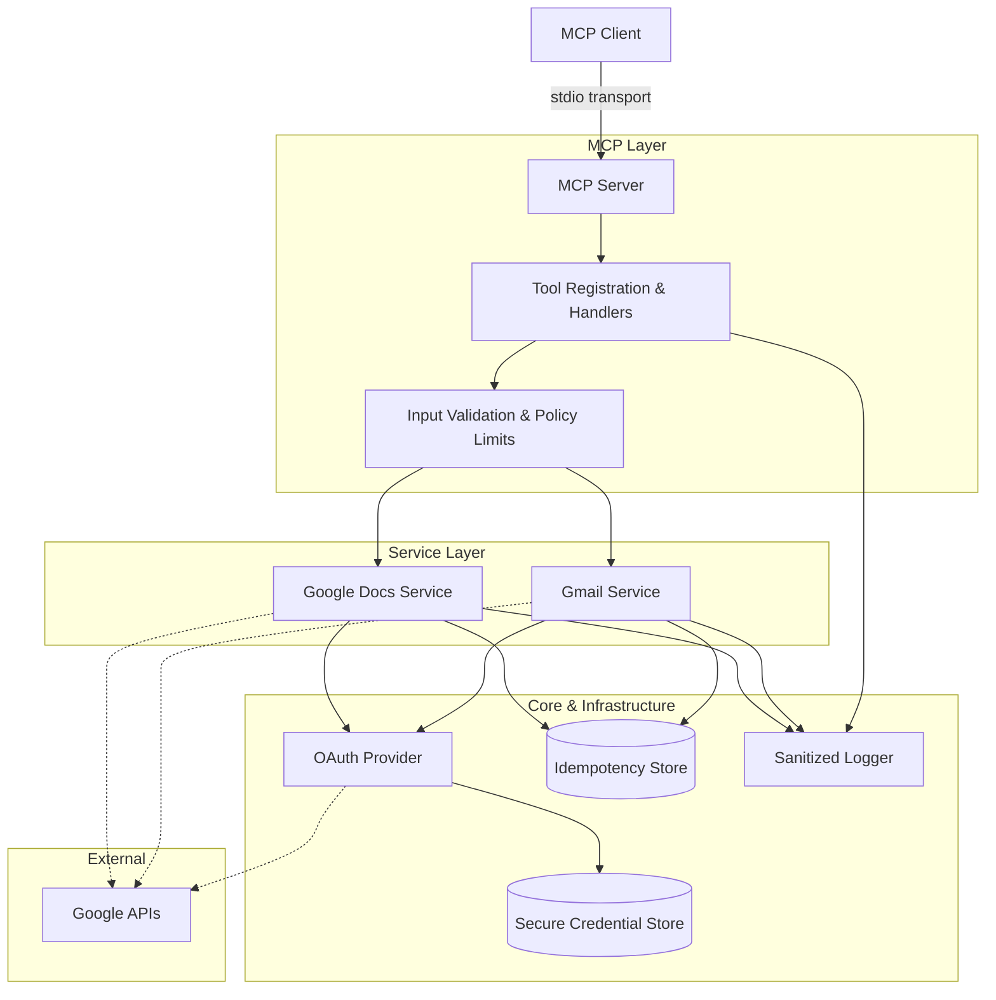

# Architecture: Generic Gmail and Google Docs MCP Server

## 1. Overview

The server follows a modular architecture designed to cleanly separate the Model Context Protocol (MCP) transport from the core business logic, Google API interactions, authentication, and infrastructure. This ensures that the server remains testable, secure, and maintainable.

## 2. Component Architecture

## 3. Logical Boundaries

The codebase is organized into well-defined modules:

- **`server`**: Responsible for MCP startup, transport initialization (focusing on `stdio` for V1), and exposing the tool registration interface.
- **`tools`**: Contains agent-facing tool definitions (schemas) and result mapping. It shapes internal results into structured, machine-readable JSON responses.
- **`services`**: Contains the core logic for Gmail and Google Docs operations.
- **`auth`**: Handles the Google OAuth 2.0 flow, token refreshing, and abstracts credential storage so secrets are kept secure.
- **`validation`**: Enforces strict JSON schemas and security constraints (e.g., rejecting malformed emails, enforcing max size limits).
- **`infrastructure`**: Provides shared cross-cutting concerns:
  - Sanitized structured logging.
  - Retry policies for transient failures.
  - Configuration loading (via environment variables or config files).
  - Idempotency tracking to prevent duplicates.

## 4. Execution Flow (Example: Modifying Action)

1. **Invocation**: An MCP client invokes a tool (e.g., `gmail_send_email`) over `stdio`.
2. **Validation**: The tool handler validates the payload against the predefined schema and enforces policy limits.
3. **Idempotency Check**: If an `idempotency_key` is provided, the system checks the Idempotency Store to prevent duplicate executions.
4. **Authorization**: The service requests a valid, unexpired OAuth token from the Auth module.
5. **Execution**: The service constructs the MIME message (or request payload) and makes the Google API call.
6. **Error Handling**: Any upstream errors (e.g., rate limits, permission denied) are caught and mapped to standard, stable error codes (`RATE_LIMITED`, `PERMISSION_DENIED`, etc.).
7. **Persistence & Response**: The operation result is stored for idempotency, and a structured JSON result is returned to the MCP client.

## 5. Security & Privacy Considerations

- **Authentication**: Relies entirely on Google OAuth 2.0 with local interactive authorization for development.
- **Least Privilege**: Requests only the scopes necessary for the enabled tools. Gmail and Docs scopes are separated.
- **Sanitized Logging**: Logs are strictly metadata-only (operation name, timestamp, outcome, latency). Tokens, email bodies, recipient lists, and document content are never logged by default.
- **Safety Boundaries**: Drafting an email and sending an email are strictly isolated into two different tools (`gmail_create_draft` vs `gmail_send_email`) to prevent accidental sends.

## 6. Recommended V1 Deployment Mode

- **Identity**: Single configured Google identity per server process.
- **Transport**: Local `stdio` MCP client connection.
- **State**: Uses a local persistent idempotency store and local file-backed encrypted token storage.
- **Capabilities**: Plain-text Google Docs append; plain-text email with optional sanitized HTML alternatives.
